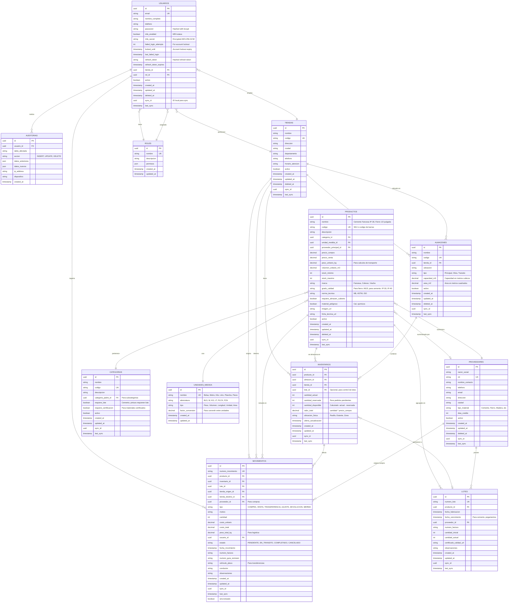

# System Management API

A comprehensive inventory and warehouse management system built with NestJS, TypeORM, and PostgreSQL. Features include multi-factor authentication (MFA), role-based access control, and real-time inventory tracking.

## Features

- 🔐 **Authentication & Security**
  - JWT-based authentication
  - Multi-Factor Authentication (MFA) with TOTP
  - Role-based access control (RBAC)
  - Password hashing with bcrypt (12 rounds)
  - **Strong password policy** enforcement
  - **Token refresh** mechanism with secure refresh tokens
  - **Session management** with logout and revoke capabilities
  - **Rate limiting** to prevent brute force attacks
  - **Account lockout** after failed login attempts
  - **MFA secret encryption** at rest (AES-256-GCM)
  - **Input validation** for foreign keys

- 👥 **User Management**
  - User registration and authentication
  - Role and permission management
  - User profile management

- 🏪 **Store Management**
  - Multiple store locations
  - Warehouse management per store
  - Physical location tracking

- 📦 **Product & Inventory**
  - Product catalog with categories
  - Supplier management
  - Batch/Lot tracking
  - Real-time inventory levels
  - Stock reservations

- 📊 **Movement Tracking**
  - Purchase orders
  - Sales transactions
  - Inter-store transfers
  - Inventory adjustments
  - Returns and shrinkage tracking

- 📝 **Audit Logging**
  - Complete action history
  - User activity tracking
  - Data change logs

## Technologies Used

- [NestJS](https://nestjs.com/) - Progressive Node.js framework
- [TypeORM](https://typeorm.io/) - ORM for TypeScript and JavaScript
- [PostgreSQL](https://www.postgresql.org/) - Primary database
- [Passport.js](http://www.passportjs.org/) - Authentication middleware
- [JWT](https://jwt.io/) - JSON Web Tokens
- [OTPLib](https://github.com/yeojz/otplib) - TOTP/HOTP generation
- [QRCode](https://github.com/soldair/node-qrcode) - QR code generation
- [Swagger/OpenAPI](https://swagger.io/) - API documentation

## Entity Relationship Diagram



## Folder Structure

```
system-management
├── src
│   ├── main.ts
│   ├── app.module.ts
│   ├── config
│   │   ├── database.config.ts
│   │   └── database.provider.ts
│   ├── entities
│   │   ├── usuario.entity.ts
│   │   ├── rol.entity.ts
│   │   ├── tienda.entity.ts
│   │   ├── almacen.entity.ts
│   │   ├── categoria.entity.ts
│   │   ├── unidad-medida.entity.ts
│   │   ├── proveedor.entity.ts
│   │   ├── producto.entity.ts
│   │   ├── lote.entity.ts
│   │   ├── inventario.entity.ts
│   │   ├── movimiento.entity.ts
│   │   └── auditoria.entity.ts
│   ├── modules
│   │   ├── usuarios
│   │   ├── tiendas
│   │   ├── productos
│   │   ├── inventarios
│   │   └── movimientos
│   ├── common
│   └── migrations
├── test
├── package.json
├── tsconfig.json
├── nest-cli.json
├── .env
└── .env.example
```

## Installation

1. **Clone the repository**
```bash
git clone <repository-url>
cd system-management
```

2. **Install dependencies**
```bash
npm install
```

3. **Set up environment variables**

Copy `.env.example` to `.env` and configure:

```bash
cp .env.example .env
```

Edit `.env` with your configuration:

```env
# Database
DATABASE_HOST=localhost
DATABASE_PORT=5432
DATABASE_USERNAME=postgres
DATABASE_PASSWORD=postgres
DATABASE_NAME=system_management

# JWT Configuration
JWT_SECRET=your-super-secret-jwt-key-change-in-production
JWT_EXPIRATION=24h

# Encryption (generate with: openssl rand -hex 32)
ENCRYPTION_KEY=your-256-bit-hex-encryption-key

# Application
PORT=3000
```

4. **Start PostgreSQL database**

Using Docker:
```bash
docker-compose up -d
```

Or use your local PostgreSQL instance.

5. **Run database migrations and seeds**

```bash
# Seed initial data (roles, stores, units of measure)
npm run seed
```

## Running the Application

**Development mode:**
```bash
npm run start:dev
```

**Production mode:**
```bash
npm run build
npm run start:prod
```

**Access the API:**
- API Base URL: `http://localhost:3000`
- Swagger Documentation: `http://localhost:3000/api`

## API Documentation

### Authentication Endpoints

#### 1. Get Available Roles
```bash
GET /auth/roles
```

**Response:**
```json
[
  {
    "id": "uuid",
    "nombre": "Administrador",
    "descripcion": "Acceso total al sistema"
  }
]
```

#### 2. Get Available Stores
```bash
GET /auth/tiendas
```

**Response:**
```json
[
  {
    "id": "uuid",
    "nombre": "Tienda Central",
    "codigo": "TC-001",
    "ciudad": "La Paz",
    "departamento": "La Paz"
  }
]
```

#### 3. Register New User
```bash
POST /auth/register
Content-Type: application/json

{
  "email": "admin@example.com",
  "password": "SecurePass123!",
  "nombre_completo": "Administrador Principal",
  "telefono": "+591 70123456",
  "tiendaId": "uuid-from-tiendas-endpoint",
  "rolId": "uuid-from-roles-endpoint"
}
```

**Password Requirements:**
- Minimum 8 characters
- At least one uppercase letter
- At least one lowercase letter
- At least one number
- At least one special character (!@#$%^&*()_+-=[]{};\':"|,.<>/?)
- No common passwords (password, qwerty, admin, etc.)
- No more than 2 consecutive repeated characters

**Response:**
```json
{
  "user": {
    "id": "uuid",
    "email": "admin@example.com",
    "nombre_completo": "Administrador Principal",
    "mfa_enabled": false
  },
  "access_token": "eyJhbGciOiJIUzI1NiIsInR5cCI6IkpXVCJ9...",
  "refresh_token": "secure-refresh-token...",
  "expires_in": "24h",
  "refresh_expires_in": "7 days"
}
```

#### 4. Login
```bash
POST /auth/login
Content-Type: application/json

{
  "email": "admin@example.com",
  "password": "Admin123!"
}
```

**Response (without MFA):**
```json
{
  "access_token": "eyJhbGciOiJIUzI1NiIsInR5cCI6IkpXVCJ9...",
  "refresh_token": "secure-refresh-token...",
  "expires_in": "24h",
  "refresh_expires_in": "7 days",
  "user": {
    "id": "uuid",
    "email": "admin@example.com",
    "nombre_completo": "Administrador Principal"
  }
}
```

**Response (with MFA enabled):**
```json
{
  "requires_mfa": true,
  "temp_token": "temporary-token",
  "message": "Por favor ingrese su código MFA"
}
```

#### 5. Enable MFA
```bash
POST /auth/mfa/enable
Authorization: Bearer <access_token>
```

**Response:**
```json
{
  "secret": "base32-secret",
  "qrCode": "data:image/png;base64,...",
  "message": "Escanee el código QR con su aplicación de autenticación"
}
```

**Steps to enable MFA:**
1. Call this endpoint with your JWT token
2. Scan the QR code with Google Authenticator, Authy, or similar app
3. The app will generate a 6-digit code
4. Use that code to confirm MFA setup (next endpoint)

#### 6. Verify MFA Setup
```bash
POST /auth/mfa/enable/verify
Authorization: Bearer <access_token>
Content-Type: application/json

{
  "token": "123456"
}
```

**Response:**
```json
{
  "message": "MFA habilitado exitosamente"
}
```

#### 7. Verify MFA During Login
```bash
POST /auth/mfa/verify
Content-Type: application/json

{
  "temp_token": "temporary-token-from-login",
  "token": "123456"
}
```

**Response:**
```json
{
  "access_token": "eyJhbGciOiJIUzI1NiIsInR5cCI6IkpXVCJ9...",
  "user": {
    "id": "uuid",
    "email": "admin@example.com"
  }
}
```

#### 8. Disable MFA
```bash
POST /auth/mfa/disable
Authorization: Bearer <access_token>
```

**Response:**
```json
{
  "message": "MFA deshabilitado exitosamente"
}
```

#### 9. Get User Profile
```bash
GET /auth/profile
Authorization: Bearer <access_token>
```

Example
**Response:**
```json
{
  "id": "1ec4439f-adf2-493b-b2d0-8cb37936a4d2",
  "email": "usuario43@example.com",
  "nombre_completo": "Juan Pérez Perez",
  "telefono": "+591 70123456",
  "password": "[HASHED_PASSWORD]",
  "mfa_enabled": true,
  "mfa_secret": "[ENCRYPTED_DATA]",
  "failed_login_attempts": 0,
  "locked_until": null,
  "last_failed_login": null,
  "refresh_token": null,
  "refresh_token_expires": null,
  "activo": true,
  "created_at": "2025-11-27T04:10:05.438Z",
  "updated_at": "2025-11-27T04:10:05.438Z",
  "deleted_at": null,
  "sync_id": null,
  "last_sync": null,
  "tienda": {
    "id": "2a1b9c90-9d42-46d3-8dc7-b347ba306c5b",
    "nombre": "Tienda Central",
    "codigo": "TC-001",
    "direccion": "Av. 6 de Agosto #123",
    "ciudad": "La Paz",
    "departamento": "La Paz",
    "telefono": "+591 2-2345678",
    "horario_atencion": "Lunes a Viernes: 8:00 - 18:00, Sábados: 8:00 - 13:00",
    "activo": true,
    "created_at": "2025-11-23T07:30:07.077Z",
    "updated_at": "2025-11-23T07:30:07.077Z",
    "deleted_at": null,
    "sync_id": null,
    "last_sync": null
  },
  "rol": {
    "id": "f8cd5634-77d5-46ac-adf2-6a58e6abb25b",
    "nombre": "Gerente",
    "descripcion": "Gestión de operaciones",
    "permisos": {
      "usuarios": [
        "read"
      ],
      "productos": [
        "create",
        "read",
        "update"
      ],
      "inventarios": [
        "read",
        "update"
      ],
      "movimientos": [
        "create",
        "read",
        "update"
      ],
      "tiendas": [
        "read"
      ]
    },
    "created_at": "2025-11-23T07:30:07.059Z",
    "updated_at": "2025-11-23T07:30:07.059Z"
  }
}
```

#### 10. Refresh Token
```bash
POST /auth/refresh
Content-Type: application/json

{
  "refresh_token": "your-refresh-token"
}
```

**Response:**
```json
{
  "access_token": "new-access-token...",
  "refresh_token": "new-refresh-token...",
  "expires_in": "24h",
  "refresh_expires_in": "7 days",
  "user": { ... }
}
```

#### 11. Logout
```bash
POST /auth/logout
Authorization: Bearer <access_token>
```

**Response:**
```json
{
  "message": "Sesión cerrada exitosamente"
}
```

#### 12. Revoke All Sessions
```bash
POST /auth/revoke-all
Authorization: Bearer <access_token>
```

**Response:**
```json
{
  "message": "Todas las sesiones han sido revocadas"
}
```

## MFA Flow Example

### Complete MFA Setup Flow:

1. **Register and Login:**
```bash
# Register
curl -X POST http://localhost:3000/auth/register \
  -H "Content-Type: application/json" \
  -d '{
    "email": "user@example.com",
    "password": "Password123!",
    "nombre_completo": "Test User",
    "telefono": "+591 70123456",
    "tiendaId": "<TIENDA_ID>",
    "rolId": "<ROL_ID>"
  }'

# Login to get access token
curl -X POST http://localhost:3000/auth/login \
  -H "Content-Type: application/json" \
  -d '{
    "email": "user@example.com",
    "password": "Password123!"
  }'
```

2. **Enable MFA:**
```bash
curl -X POST http://localhost:3000/auth/mfa/enable \
  -H "Authorization: Bearer <ACCESS_TOKEN>"
```

3. **Scan QR Code** with your authenticator app (Google Authenticator, Authy, etc.)

4. **Verify MFA Setup:**
```bash
curl -X POST http://localhost:3000/auth/mfa/enable/verify \
  -H "Authorization: Bearer <ACCESS_TOKEN>" \
  -H "Content-Type: application/json" \
  -d '{
    "token": "123456"
  }'
```

5. **Next Login (with MFA):**
```bash
# Step 1: Login
curl -X POST http://localhost:3000/auth/login \
  -H "Content-Type: application/json" \
  -d '{
    "email": "user@example.com",
    "password": "Password123!"
  }'

# Response: { "requires_mfa": true, "temp_token": "..." }

# Step 2: Verify MFA code
curl -X POST http://localhost:3000/auth/mfa/verify \
  -H "Content-Type: application/json" \
  -d '{
    "temp_token": "<TEMP_TOKEN>",
    "token": "123456"
  }'
```

## Testing

**Unit tests:**
```bash
npm run test
```

**E2E tests:**
```bash
npm run test:e2e
```

**Test coverage:**
```bash
npm run test:cov
```

## Database Seeding

The application includes initial seed data:

**Roles:**
- Administrador - Full system access
- Gerente - Operations management
- Vendedor - Sales and queries
- Almacenero - Warehouse management

**Stores:**
- Tienda Central (La Paz)
- Tienda Norte (La Paz)
- Tienda Sur (Santa Cruz)

**Units of Measure:**
- Bolsa (BLS), Metro (M), Kilogramo (KG), Litro (LT), Plancha (PLCH), Pieza (PZA), Metro Cuadrado (M2)

Run seeds:
```bash
npm run seed
```

## Project Structure

```
src/
├── config/                    # Configuration files
│   ├── database.config.ts
│   └── database.provider.ts
├── database/                  # Database seeds
│   ├── seed.ts
│   └── seeds/
│       └── initial-seed.ts
├── entities/                  # TypeORM entities
│   ├── usuario.entity.ts
│   ├── rol.entity.ts
│   ├── tienda.entity.ts
│   ├── almacen.entity.ts
│   ├── categoria.entity.ts
│   ├── unidad-medida.entity.ts
│   ├── proveedor.entity.ts
│   ├── producto.entity.ts
│   ├── lote.entity.ts
│   ├── inventario.entity.ts
│   ├── movimiento.entity.ts
│   └── auditoria.entity.ts
├── modules/
│   ├── auth/                  # Authentication module
│   │   ├── dto/
│   │   ├── guards/
│   │   ├── strategies/
│   │   ├── auth.controller.ts
│   │   ├── auth.service.ts
│   │   └── auth.module.ts
│   ├── usuarios/              # Users module
│   ├── tiendas/               # Stores module
│   ├── productos/             # Products module
│   ├── inventarios/           # Inventory module
│   └── movimientos/           # Movements module
├── common/                    # Shared resources
│   ├── services/
│   │   └── encryption.service.ts  # AES-256 encryption
│   ├── validators/
│   │   └── password-policy.validator.ts  # Strong password enforcement
│   ├── decorators/
│   ├── filters/
│   ├── guards/
│   ├── interceptors/
│   └── pipes/
├── app.module.ts
└── main.ts
```

## Environment Variables

| Variable | Description | Default |
|----------|-------------|---------|
| `DATABASE_HOST` | PostgreSQL host | `localhost` |
| `DATABASE_PORT` | PostgreSQL port | `5432` |
| `DATABASE_USERNAME` | Database user | `postgres` |
| `DATABASE_PASSWORD` | Database password | `postgres` |
| `DATABASE_NAME` | Database name | `system_management` |
| `JWT_SECRET` | Secret key for JWT | Required |
| `JWT_EXPIRATION` | Token expiration time | `24h` |
| `ENCRYPTION_KEY` | AES-256 encryption key for MFA secrets | Required |
| `PORT` | Application port | `3000` |

## Security Features (CIA Triad)

### 🔐 Confidentiality
- **MFA Secret Encryption**: All MFA secrets are encrypted at rest using AES-256-GCM
- **Password Hashing**: Passwords hashed with bcrypt (12 rounds)
- **Sensitive Data Protection**: Passwords and MFA secrets are never returned in API responses

### 🛡️ Integrity
- **Input Validation**: Foreign keys (tiendaId, rolId) are validated before user creation
- **Data Validation**: All DTOs use class-validator for input sanitization
- **Secure Token Generation**: TOTP tokens use cryptographically secure random generation

### ⚡ Availability
- **Account Lockout**: Accounts are locked after 5 failed login attempts for 15 minutes
- **Automatic Unlock**: Accounts automatically unlock after the lockout period
- **Failed Attempt Tracking**: System tracks failed login attempts and timestamps
- **Rate Limiting**: Prevents brute force attacks with configurable request limits

### Rate Limiting

Rate limiting is applied globally and with stricter limits on authentication endpoints:

| Endpoint | Limit | Time Window |
|----------|-------|-------------|
| `/auth/register` | 3 requests | 1 minute |
| `/auth/login` | 5 requests | 1 minute |
| `/auth/mfa/verify` | 5 requests | 1 minute |
| `/auth/refresh` | 10 requests | 1 minute |
| Global (default) | 100 requests | 1 minute |

**Environment Variables for Rate Limiting:**
```env
THROTTLE_SHORT_TTL=1000      # Short window (ms)
THROTTLE_SHORT_LIMIT=3       # Requests per short window
THROTTLE_MEDIUM_TTL=10000    # Medium window (ms)
THROTTLE_MEDIUM_LIMIT=20     # Requests per medium window
THROTTLE_LONG_TTL=60000      # Long window (ms)
THROTTLE_LONG_LIMIT=100      # Requests per long window
```

### Security Configuration

```typescript
// In auth.service.ts
const MAX_FAILED_ATTEMPTS = 5;        // Lock after 5 failed attempts
const LOCKOUT_DURATION_MINUTES = 15;  // Lock for 15 minutes  
const BCRYPT_ROUNDS = 12;             // Password hashing strength
const REFRESH_TOKEN_EXPIRY_DAYS = 7;  // Refresh token validity
```

### Password Policy

```typescript
// Password requirements enforced by validator
{
  minLength: 12,
  maxLength: 128,
  requireUppercase: true,
  requireLowercase: true,
  requireNumbers: true,
  requireSpecialChars: true
}
// Also blocks common passwords and repeated characters
```

### Generate Secure Keys

```bash
# Generate ENCRYPTION_KEY (256-bit hex)
openssl rand -hex 32

# Generate JWT_SECRET
openssl rand -base64 32
```

## Security Best Practices

1. **Never commit `.env` file** - Use `.env.example` as template
2. **Change JWT_SECRET** in production to a strong random string
3. **Generate unique ENCRYPTION_KEY** for each environment
4. **Use HTTPS** in production
5. **Enable MFA** for admin accounts
6. **Regular password rotation** policies
7. **Keep dependencies updated**: `npm audit` and `npm update`
8. **Monitor failed login attempts** for potential attacks

## Common Issues

### JWT Token Expires Too Quickly
- Check `JWT_EXPIRATION` in `.env`
- Should be in format: `24h`, `7d`, `60m`, not numeric values

### Foreign Key Constraint Error on User Registration
- Run `npm run seed` to create initial roles and stores
- Get valid IDs from `/auth/roles` and `/auth/tiendas`

### MFA QR Code Not Scanning
- Ensure QR code image is fully loaded
- Try manually entering the secret key in your authenticator app

### Account Locked
- Wait 15 minutes for automatic unlock
- Or manually reset in database: `UPDATE "USUARIOS" SET failed_login_attempts = 0, locked_until = NULL WHERE email = 'user@example.com'`

### Encryption Error
- Ensure `ENCRYPTION_KEY` is set in `.env`
- Key must be a valid hex string (64 characters for 256-bit)

## Contributing

1. Fork the repository
2. Create your feature branch (`git checkout -b feature/amazing-feature`)
3. Commit your changes (`git commit -m 'Add some amazing feature'`)
4. Push to the branch (`git push origin feature/amazing-feature`)
5. Open a Pull Request

## License

This project is licensed under the UNLICENSED License.
